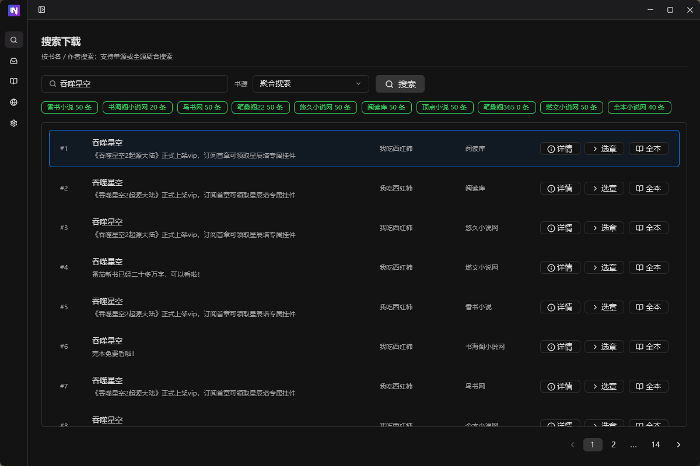
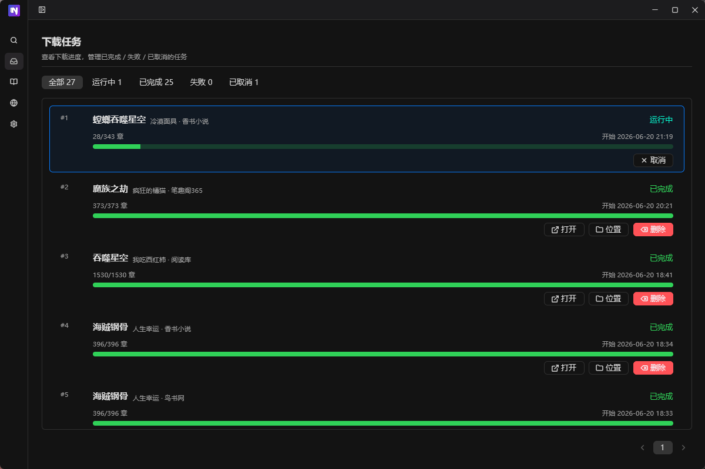
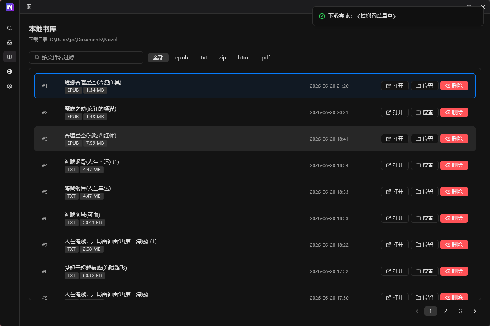
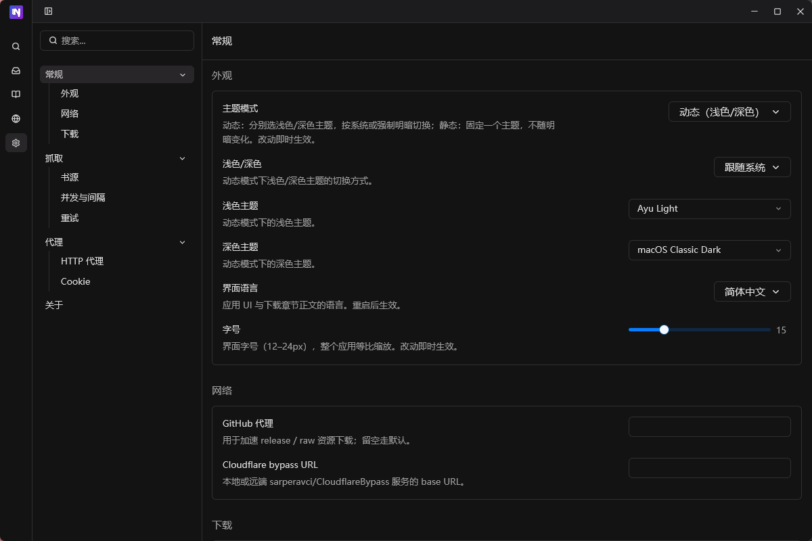

<div align="center">


# So Novel

**多源聚合小说搜索下载器 · Rust + GPUI 桌面客户端**

原生桌面应用，支持多源搜索、并发下载、简繁转换与多格式导出。

[](https://github.com/Ahjxs/so-novel-rs/releases/latest)
[](./LICENSE)
[](https://www.rust-lang.org)
[](#-快速开始)
[](https://github.com/Ahjxs/so-novel-rs/stargazers)

[功能](#-功能) · [技术栈](#-技术栈) · [快速开始](#-快速开始) · [CLI](#-cli-用法) · [快捷键](#-快捷键) · [免责声明](./DISCLAIMER.md)

</div>

---

## 📸 截图

| 搜索 | 任务 |
|:---:|:---:|
|  |  |

| 书库 | 设置 |
|:---:|:---:|
|  |  |

## ✨ 功能

| | |
|---|---|
| 🔍 **多源搜索** | 聚合多书源并发搜索、相似度过滤排序、quanben5 加密搜索、详情面板、封面预览、选章下载 |
| 📥 **下载任务** | 并发抓取、失败重试、进度跟踪、取消、封面嵌入、持久化、章节范围、**简繁自动转换** |
| 📚 **本地书库** | 扫描已下载书籍，按格式/日期/大小排序，删除二次确认（无空态闪烁） |
| 🔌 **书源管理** | 多规则文件切换、JSON 导入、启用/禁用、连通性测速 |
| 📄 **多格式导出** | EPUB / TXT（多编码）/ HTML（zip 打包）/ **PDF**（DocumentBuilder 直接构建，CJK 字体嵌入） |
| 🎨 **主题系统** | 38 个可用主题，文件 watcher 热重载，无需重启 |
| 🌐 **多语言** | 简体中文 / 繁体中文 / English，UI 即时切换 |
| 💻 **CLI 模式** | `search` / `download` / `sources` 子命令，`--json` 机器可读输出 |
| 🔄 **更新检查** | 自动检测 GitHub Release，有新版时一键跳转下载 |

## 🛠 技术栈

| 领域 | 选型 |
|------|------|
| 🎨 GUI | [GPUI 0.2](https://gpui.rs) + [gpui-component 0.5](https://github.com/longbridge/gpui-component) |
| ⚡ 异步 | [tokio 1](https://tokio.rs) (rt-multi-thread) |
| 🌐 HTTP | [reqwest 0.13](https://docs.rs/reqwest) (rustls，无 OpenSSL) |
| 🔍 HTML 解析 | scraper 0.27 + regex |
| 📜 JS 引擎 | [boa_engine](https://github.com/boa-dev/boa)（书源规则 `@js:` 后处理 + 加密） |
| 💾 持久化 | JSON 文件（原子写入，零依赖） |
| ⚙️ 配置 | [toml_edit](https://docs.rs/toml_edit)（保留注释与字段顺序） |
| 🌏 国际化 | [rust-i18n](https://docs.rs/rust-i18n)（编译期嵌入） |
| 🈶 简繁转换 | [zhconv](https://docs.rs/zhconv)（OpenCC + MediaWiki 词表，纯 Rust） |
| 📦 导出 | epub-builder / zip / encoding_rs / pdf_oxide |
| 📂 文件选择 | [rfd](https://docs.rs/rfd) `AsyncFileDialog` |

## 📂 项目结构

```
so-novel-rs/
├── assets/                # logo
├── bundle/
│   ├── rules/             # 默认书源 JSON（首次启动复制到 ~/.sonovel/rules/）
│   └── web/               # Web 前端静态资源
├── locales/app.yml        # i18n 翻译（zh-CN / zh-HK / en）
└── src/
    ├── main.rs            # 入口（GUI / CLI / Web）
    ├── cli.rs             # CLI 子命令
    ├── app/               # 业务层（与 GUI 解耦）
    │   └── ops/           # download / search / sources / library / settings / update
    ├── config/            # config.toml 读写
    ├── persistent/        # JSON 持久化（tasks.json / sources_config.json / rules/）
    ├── models/            # Rule / Book / Chapter / SearchResult / TaskRecord
    ├── crawler/           # 搜索 / 下载 / 重试 / 健康检测
    ├── parser/            # HTML 解析
    ├── http/              # HTTP 客户端 / 代理 / CF 旁路
    ├── export/            # EPUB / TXT / HTML / PDF
    ├── js/                # boa_engine（@js: 后处理）
    ├── gpui_app/          # GPUI 桌面 GUI（5 个页面）
    ├── web/               # Web 服务（axum + SSE）
    └── util/              # 工具函数
```

## 🚀 快速开始

```sh
# 克隆 & 编译
git clone https://github.com/Ahjxs/so-novel-rs.git
cd so-novel-rs
cargo run
```

> **前置依赖**：Rust 1.85+，Windows / macOS / Linux 均可。Windows 下首次 GPUI 构建需设 `GPUI_FXC_PATH`（详见 [build.rs](./build.rs)）。

应用数据存放在 `~/.sonovel/`，首次启动自动创建：

| 路径 | 用途 |
|------|------|
| `config.toml` | 用户配置（保留注释） |
| `rules/` | 书源规则文件（JSON，首次启动从 bundle 复制） |
| `sources_config.json` | 书源配置（当前选中的规则文件 + 禁用列表） |
| `tasks.json` | 下载任务记录（自动清理超额的已完成任务） |
| `themes/` | 用户主题目录（JSON，热重载） |

### 💻 CLI 用法

不带子命令启动 GUI，带子命令走 CLI：

```sh
# 搜索（与 GUI 一致：自动按相似度过滤 + 排序）
so-novel-rs search "斗破苍穹"
so-novel-rs search "斗破苍穹" --source 1 --limit 10 --json | jq length

# 下载
so-novel-rs download "https://example.com/book/123" --format epub
so-novel-rs download "https://example.com/book/123" --output D:\novels --format txt

# 列出书源
so-novel-rs sources --json
```

### 🌐 Web 模式

启动 Web 服务器，通过浏览器访问：

```sh
# 命令行启动
so-novel-rs --web
so-novel-rs --web --host 0.0.0.0 --port 9000

# 环境变量（Docker 友好）
SO_NOVEL_WEB=1 so-novel-rs
```

浏览器打开 `http://localhost:8080` 即可使用。支持手机、平板、桌面多端响应式。

> **默认绑定 `127.0.0.1:8080`，仅本机访问。** 如果需要在局域网或 Docker
> 容器中对外服务，显式传 `--host 0.0.0.0`。

### 🐳 Docker 部署

```sh
# 构建镜像
docker build -t so-novel .

# 运行（挂载数据目录）
docker run -d -p 8080:8080 -v so-novel-data:/root/.sonovel --name so-novel so-novel

# 自定义端口
docker run -d -p 9000:8080 -e SO_NOVEL_WEB=1 so-novel
```

`config.toml` 存放在 `/root/.sonovel/config.toml`（容器内），下载的文件在 `/root/Documents/Novel/`。

### 📦 打包

```sh
cargo build --release                                       # 当前平台（Windows 无控制台窗口）
cargo build --release --target x86_64-unknown-linux-gnu     # Linux
cargo build --release --target aarch64-unknown-linux-gnu    # Linux ARM64
```

产物在 `target/<triple>/release/so-novel-rs[.exe]`，可单独分发。

## ⌨️ 快捷键

| 快捷键 | 功能 |
|--------|------|
| `Cmd/Ctrl + 1..5` | 直跳页面（搜索 / 任务 / 书库 / 书源 / 设置） |
| `Cmd/Ctrl + B` | 折叠 / 展开 Sidebar |
| `F6` / `Shift+F6` | 翻页（避开 Input 的 Tab 绑定） |
| `Escape` | 关闭 Dialog / Sheet / Notification |

## 🤝 贡献

欢迎 PR！本项目采用 AGPL-3.0 协议，贡献即同意按该协议授权。

* 提交前跑 `cargo fmt` + `cargo clippy --all-targets -- -D warnings` + `cargo test --lib`
* 新增 / 改动 UI 文案 → 同步 `locales/app.yml` 三语
* 新增书源 → 走 `bundle/rules/` JSON，规则语法见 `rule-template.json5`（如存在）

## 🙏 致谢

本项目基于 [freeok/so-novel](https://github.com/freeok/so-novel)（Java 版）重写为 Rust + GPUI 原生桌面客户端。感谢原作者的书源规则设计与核心架构思路。

## ⚠️ 免责声明

本项目是**技术工具**，仅供个人学习与研究使用。**严禁用于侵犯著作权、传播非法内容等任何违法用途**。详细条款见 [DISCLAIMER.md](./DISCLAIMER.md)。

## 📄 License

本项目基于 [AGPL-3.0](./LICENSE) 协议开源。
