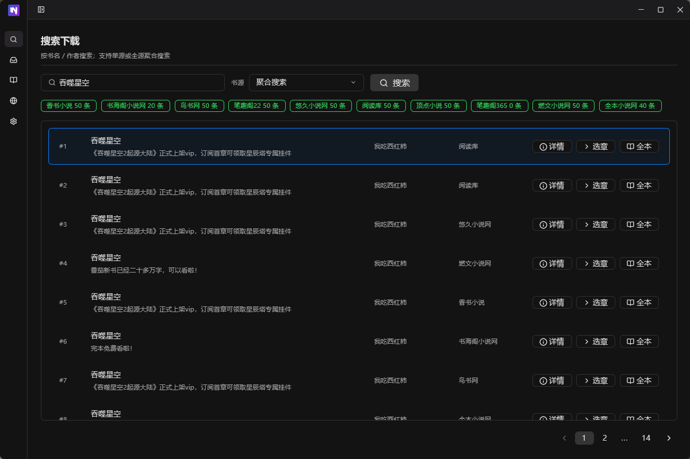
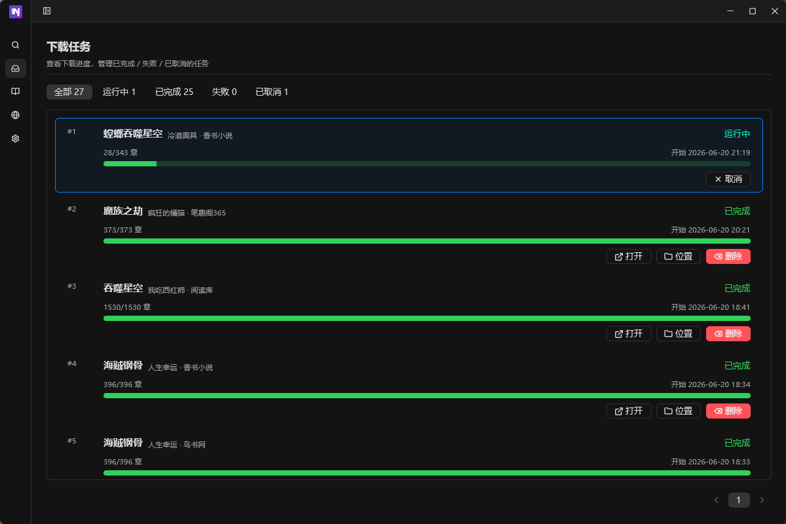
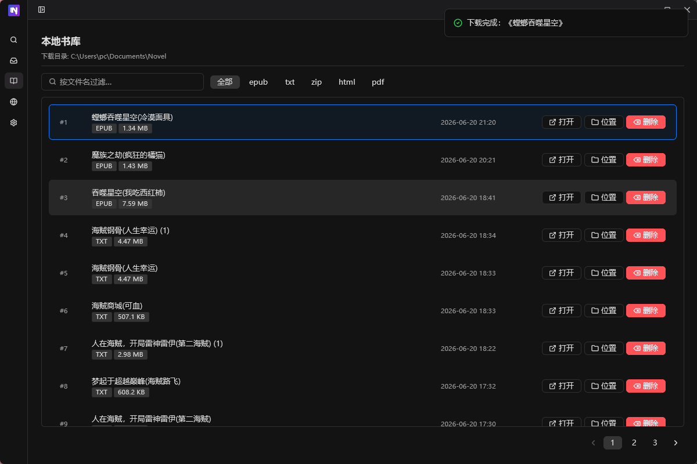
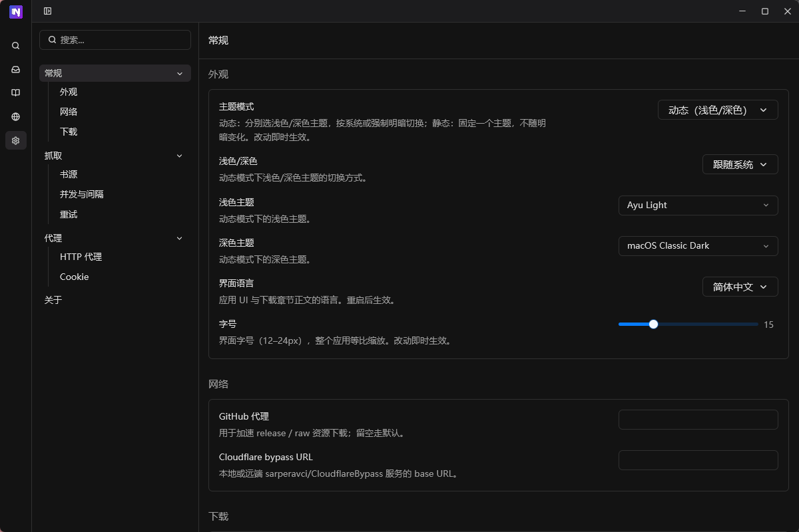

<div align="center">


# So Novel

**多源聚合小说搜索下载器 · Rust + GPUI 桌面客户端**

原生桌面应用，支持多源搜索、并发下载、简繁转换与多格式导出。

[](https://github.com/Ahjxs/so-novel-rs/releases/latest)
[](./LICENSE)
[](https://www.rust-lang.org)
[](#-快速开始)
[](https://github.com/Ahjxs/so-novel-rs/stargazers)

[功能](#-功能) · [安装](#-安装) · [技术栈](#-技术栈) · [快速开始](#-快速开始) · [快捷键](#-快捷键) · [免责声明](./DISCLAIMER.md)

</div>

---

## 📸 截图

> ⚠️ 截图为旧版界面，待重新截图替换。

| 搜索 | 任务 |
|:---:|:---:|
|  |  |

| 书库 | 设置 |
|:---:|:---:|
|  |  |

## ✨ 功能

| | |
|---|---|
| 🔍 **多源搜索** | 聚合多书源并发搜索、相似度过滤排序、quanben5 加密搜索、详情面板、封面预览、选章下载 |
| 📥 **下载任务** | 并发抓取、失败重试、进度跟踪、取消、封面嵌入、持久化、章节范围、**简繁自动转换** |
| 📚 **本地书库** | 扫描已下载书籍，按格式/日期/大小排序，删除二次确认（无空态闪烁） |
| 🔌 **书源管理** | 多规则文件切换、JSON 导入、启用/禁用、连通性测速 |
| 📄 **多格式导出** | EPUB / TXT（多编码）/ HTML（zip 打包）/ **PDF**（DocumentBuilder 直接构建，CJK 字体嵌入） |
| 🎨 **主题系统** | 38 个可用主题，文件 watcher 热重载，无需重启 |
| 🌐 **多语言** | 简体中文 / 繁体中文 / English，UI 即时切换 |
| 🔄 **更新检查** | 自动检测 GitHub Release，有新版时一键跳转下载 |

## 🛠 技术栈

| 领域 | 选型 |
|------|------|
| 🎨 GUI | [gpui-kit 0.7](https://crates.io/crates/gpui-kit)（底层 [GPUI](https://gpui.rs) ） |
| ⚡ 异步 | [tokio 1](https://tokio.rs) (rt-multi-thread) |
| 🌐 HTTP | [reqwest 0.13](https://docs.rs/reqwest) (rustls，无 OpenSSL) |
| 🔍 HTML 解析 | scraper 0.27 + regex |
| 📜 JS 引擎 | [boa_engine](https://github.com/boa-dev/boa)（书源规则 `@js:` 后处理 + 加密） |
| 💾 持久化 | JSON 文件（原子写入，零依赖） |
| ⚙️ 配置 | [toml_edit](https://docs.rs/toml_edit)（保留注释与字段顺序） |
| 🌏 国际化 | [rust-i18n](https://docs.rs/rust-i18n)（编译期嵌入） |
| 🈶 简繁转换 | [zhconv](https://docs.rs/zhconv)（OpenCC + MediaWiki 词表，纯 Rust） |
| 📦 导出 | epub-builder / zip / encoding_rs / pdf_oxide |
| 📂 文件选择 | [rfd](https://docs.rs/rfd) `AsyncFileDialog` |

## 📂 项目结构

```
so-novel-rs/
├── assets/                # 编译期嵌入的静态资源
│   ├── logo.*             # 图标（build.rs 嵌 exe 资源段 + 侧栏 logo）
│   ├── chapter_*.tmpl     # HTML / EPUB 导出模板
│   └── rules/             # 默认书源 JSON + 模板（首次启动复制到 ~/.sonovel/rules/）
├── docs/                  # 长文档 + 截图 + 历史设计记录
│   └── screenshots/
├── locales/app.yml        # i18n 翻译（zh-CN / zh-TW / en）
├── tests/fixtures/web/    # 书源解析样例（章节页 / 封面 / JS）
└── src/
    ├── main.rs / lib.rs   # 入口 + crate 根
    ├── core/              # 业务层（与 GUI 解耦）
    ├── desktop/           # GPUI 桌面 GUI（components / model / pages / themes/）
    ├── parser/            # HTML 解析（book / chapter / toc / dom 子模块）
    ├── crawler/           # 搜索 / 下载 / 重试 / 健康检测
    ├── export/            # EPUB / TXT / HTML / PDF（含 pdf/ 子模块）
    ├── http/ js/ db/      # HTTP 客户端 / boa_engine / 持久化
    ├── config/ models/    # config.toml 读写 / 数据模型
    ├── i18n.rs error.rs   # 翻译入口 + 顶层错误
    ├── logger.rs utils/   # tracing 初始化 + 工具函数
```

**分层**: `core/` 提供与 GUI 解耦的业务逻辑,`desktop/` 是 GPUI 渲染层,共享同一份核心代码。桌面端的文案与错误提示统一走 `rust_i18n` 的 `t!` 宏按全局 locale 翻译。

## 📥 安装

无需安装 Rust，从 [GitHub Releases](https://github.com/Ahjxs/so-novel-rs/releases) 下载对应平台的可运行文件，解压后即可运行（`<版本>` 为最新版本号）：

| 平台 | 下载文件 | 运行 |
|------|---------|------|
| Windows x86_64 | `so-novel-rs-<版本>-windows-x86_64.zip` | 解压后双击 `so-novel-rs.exe` |
| Linux x86_64 | `so-novel-rs-<版本>-linux-x86_64.tar.gz` | `tar -xzf` 解压后运行 `./so-novel-rs` |
| Linux ARM64 | `so-novel-rs-<版本>-linux-aarch64.tar.gz` | 同上 |
| macOS（Apple Silicon） | `so-novel-rs-<版本>-macos-aarch64.tar.gz` | 解压后运行 `./so-novel-rs` |

> 发行包内含 `so-novel-rs` 可执行文件 + `rules/`（默认书源）。首次运行自动创建
> `~/.sonovel/` 数据目录（配置 / 书源 / 任务 / 主题）。
>
> **Windows**：SmartScreen 提示时点「更多信息 → 仍要运行」；**macOS**：首次打开可能被
> Gatekeeper 拦截，右键 →「打开」，或执行 `xattr -dr com.apple.quarantine ./so-novel-rs`。

## 🚀 快速开始

**方式一：下载安装（推荐）** —— 见上方 [📥 安装](#-安装)，直接运行可执行文件，无需编译。

**方式二：从源码编译：**

```sh
# 克隆 & 编译
git clone https://github.com/Ahjxs/so-novel-rs.git
cd so-novel-rs
cargo run
```

> **前置依赖**：Rust 1.95+，Windows / macOS / Linux 均可。Windows 下首次 GPUI 构建需设 `GPUI_FXC_PATH`（指向 DirectX `fxc.exe`，供 GPUI 编译 shader）。

应用数据存放在 `~/.sonovel/`，首次启动自动创建：

| 路径 | 用途 |
|------|------|
| `config.toml` | 用户配置（保留注释） |
| `rules/` | 书源规则文件（JSON，首次启动从内置资源复制） |
| `sources_config.json` | 书源配置（当前选中的规则文件 + 禁用列表） |
| `tasks.json` | 下载任务记录（自动清理超额的已完成任务） |
| `themes/` | 用户主题目录（JSON，热重载） |

### 📚 书源

仓库自带 6 套书源规则（位于 `assets/rules/`，首次运行复制到 `~/.sonovel/rules/`）：

- `main.json` — 默认书源（12 个，均支持搜索、大陆 IP）
- `proxy-required.json` — 需要代理的书源（4 个，非大陆 IP）
- `rate-limit.json` — 下载限流的源（4 个）
- `no-search.json` — 不支持搜索的源（2 个）
- `cloudflare.json` — 有 Cloudflare 保护的源（3 个）
- `rule-template.json5` — 自定义书源模板

切换书源集：在 GUI 的「书源」页右上角下拉选择活跃文件（或直接改
`~/.sonovel/sources_config.json` 的 `active_file`）。Cloudflare 保护的书源需要
部署 [CloudflareBypassForScraping](https://github.com/sarperavci/CloudflareBypassForScraping)
反代并设置 `cf-bypass`。

📖 完整书源表（IP 要求 / 注意事项）、CF 绕过部署步骤、排查指引见
[docs/BOOK_SOURCES.md](./docs/BOOK_SOURCES.md)。

### 📦 打包

```sh
cargo build --release                                       # 当前平台（Windows 无控制台窗口）
cargo build --release --target x86_64-unknown-linux-gnu     # Linux
cargo build --release --target aarch64-unknown-linux-gnu    # Linux ARM64
```

产物在 `target/<triple>/release/so-novel-rs[.exe]`，可单独分发。

## ⌨️ 快捷键

| 快捷键 | 功能 |
|--------|------|
| `Cmd/Ctrl + 1..5` | 直跳页面（搜索 / 任务 / 书库 / 书源 / 设置） |
| `Cmd/Ctrl + B` | 折叠 / 展开 Sidebar |
| `F6` / `Shift+F6` | 翻页（避开 Input 的 Tab 绑定） |
| `Escape` | 关闭 Dialog / Sheet / Notification |

## 🤝 贡献

欢迎 PR！本项目采用 AGPL-3.0 协议,贡献即同意按该协议授权。

* 提交前跑 `cargo fmt --all -- --check` + `cargo clippy --all-targets -- -D warnings` + `cargo test --lib`
* 新增 / 改动 UI 文案 → 同步 `locales/app.yml` 三语
* 新增书源 → 走 `assets/rules/` JSON,规则语法见 `rule-template.json5`(如存在)
* 业务函数返回错误 → 用 `AppResult<T>` + `?` 透传;边界才转 `anyhow`

## 🙏 致谢

本项目基于 [freeok/so-novel](https://github.com/freeok/so-novel)（Java 版）重写为 Rust + GPUI 原生桌面客户端。感谢原作者的书源规则设计与核心架构思路。

## ⚠️ 免责声明

本项目是**技术工具**，仅供个人学习与研究使用。**严禁用于侵犯著作权、传播非法内容等任何违法用途**。详细条款见 [DISCLAIMER.md](./DISCLAIMER.md)。

## 📄 License

本项目基于 [AGPL-3.0](./LICENSE) 协议开源。
